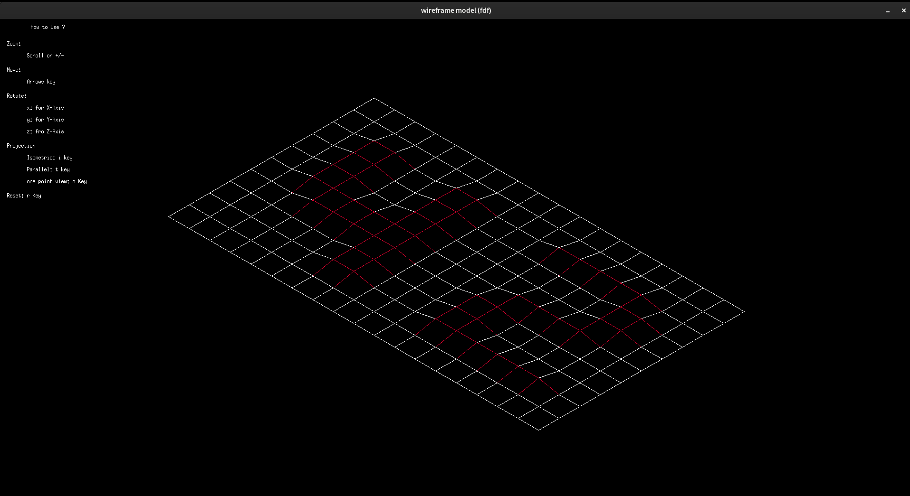

# FDF Project


## Overview

The FDF project is part of the 42 network curriculum, aimed at creating a 3D wireframe representation of a landscape based on a file containing altitude data. The project focuses on graphical programming using the MinilibX library and provides a practical introduction to computer graphics in C.

## Concepts Learned

### Computer Graphics

* **3D Projections**: Implementing techniques to project 3D points onto a 2D plane.
* **Wireframe Models**: Creating wireframe models to represent 3D objects.

### MinilibX

* **Graphics Library**: Using the MinilibX library for creating windows, drawing pixels, and handling events.
* **Event Handling**: Implementing keyboard and mouse event handling to interact with the graphics.

### C Programming

* **Dynamic Memory Allocation**: Efficiently managing dynamic memory for graphical data.
* **File Parsing**: Reading and parsing files to extract necessary data for the visualization.

## Project Description

**FDF**: The project involves creating a program that reads a file containing a 3D map's altitude data and displays a 3D wireframe representation of this map.

### Features

- **3D Projection**: Project 3D points to a 2D plane.
- **Wireframe Rendering**: Draw lines between points to create a wireframe representation.
- **Event Handling**: Allow user interaction through keyboard and mouse inputs.

## Implementation

* **File Parsing**: Read and parse the map file to extract altitude data.
* **3D to 2D Projection**: Convert 3D coordinates to 2D for display.
* **Drawing**: Use MinilibX functions to draw pixels and lines on the window.
    
## Installation and Execution

### Install Required Packages

For Debian-based systems (e.g., Ubuntu), install the required packages:

```bash
sudo apt-get update
```
```bash
sudo apt-get install make gcc libx11-dev libxext-dev
```
Clone the Repository

```bash
git clone https://github.com/khalidlakbuichy/wireframe_fdf.git
```
```bash
cd fdf
```
####  Compile the Project

```bash
make -C libs/libft
```
```bash
make -C libs/minilibx-linux
```
```bash
make
```
Run the Program

```bash

./fdf <path_to_map_file>
```
#### Example

```bash

./fdf maps/42.fdf
```
Lessons Learned

* **Graphics Programming**: Basics of creating graphics applications using a library.
* **3D Visualization**: Techniques for visualizing 3D data on a 2D screen.
* **Event Handling**: Managing user input to interact with graphical programs.

## Conclusion

The FDF project provided a practical introduction to computer graphics, teaching essential skills in 3D visualization, graphics programming, and user interaction through event handling.
